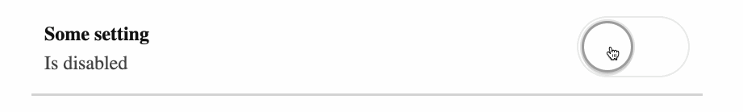

# React assessment

You are going to build a re-usable `Toggler` component responsible for toggling something ON or OFF.

To toggle between ON or OFF there is a `TogglerButton`. 

To show the correct UI dependening on the toggler state there are `TogglerOn` and `TogglerOff`.

In this excercise the component is used to toggle a setting but the same component could be re-used for things like an accordion, inline edit, etc.

I'm looking forward to your solution!

Best regards,

Jeroen Slor